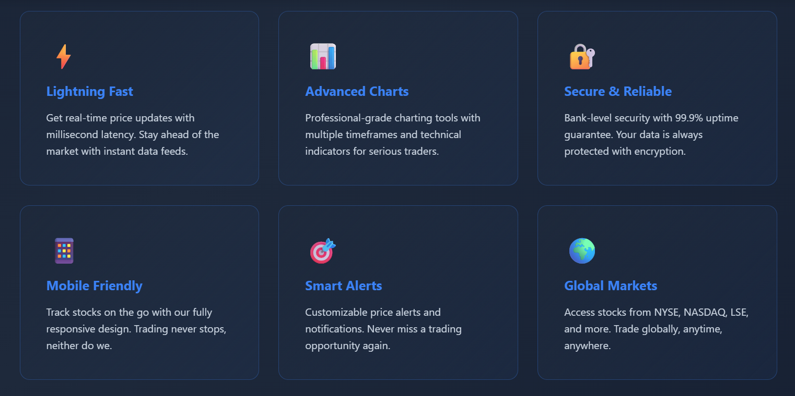
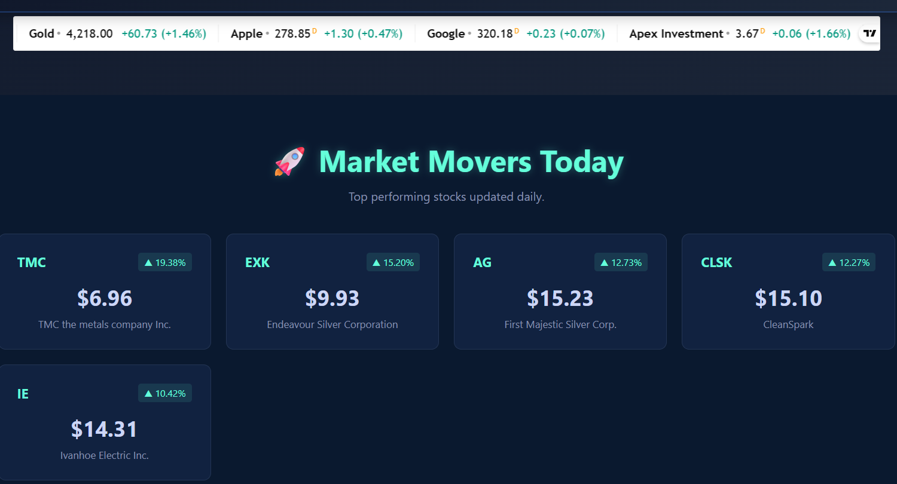

# 🚀 Apex Ticker - Real-Time Stock Market Tracker

> **Free. Fast. No Clutter. Just Your Daily Top Gainers.**

---

## ✨ What is Apex Ticker?

[Apex Ticker](https://apexticker.com) is a **free, real-time stock market tracker** that shows you the **top 5 performing stocks of the day** without requiring login, subscriptions, or dealing with ads[cite: 1].

Perfect for:
- 📈 Day traders[cite: 1]
- 🎯 Swing traders[cite: 1]  
- 💼 Casual investors[cite: 1]
- 📱 Anyone who wants quick market insights[cite: 1]

**Live Platform:** [Visit Apex Ticker - Real-Time Tracker](https://apexticker.com)

---

## 🎯 Key Features

| Feature | Benefit |
|---------|---------|
| ⚡ **Real-Time Updates** | Data refreshes every hour from Yahoo Finance[cite: 1] |
| 🔓 **No Login Required** | Open the site and start tracking instantly[cite: 1] |
| 📊 **Top 5 Gainers** | See only the stocks that matter today[cite: 1] |
| 📱 **Mobile Friendly** | Trade on any device, anytime[cite: 1] |
| 🎨 **Dark Theme** | Professional interface designed for traders[cite: 1] |
| 🚫 **Ad-Free** | Clean experience, zero distractions[cite: 1] |
| 💰 **100% Free** | Forever free, no hidden costs[cite: 1] |

---

## 🛠️ Technology Stack

**Frontend:**
- HTML5, CSS3, JavaScript (Vanilla)[cite: 1]
- Responsive Design[cite: 1]
- Dark Theme UI[cite: 1]

**Backend & Automation:**
- 🤖 **n8n** - Workflow automation (fetches data hourly)[cite: 1]
- 📊 **Yahoo Finance API** - Live stock data[cite: 1]
- 📑 **Google Sheets** - Data storage & management[cite: 1]
- 🌐 **CSV Integration** - Real-time data sync[cite: 1]

**Hosting & Deployment:**
- ⚙️ **Vercel** - Frontend hosting[cite: 1]
- 🔄 **n8n Cloud** - Automation workflows[cite: 1]
- ☁️ **Google Cloud** - Data storage[cite: 1]

---

## 📊 How It Works

┌─────────────────────────────────────────────────┐
│ 1. n8n Workflow (Every Hour)[cite: 1] │
│ └─→ Fetches live data from Yahoo Finance API[cite: 1] │
├─────────────────────────────────────────────────┤
│ 2. Google Sheets[cite: 1] │
│ └─→ Stores the top 5 gainers with prices[cite: 1] │
├─────────────────────────────────────────────────┤
│ 3. CSV Export[cite: 1] │
│ └─→ Auto-updates every hour[cite: 1] │
├─────────────────────────────────────────────────┤
│ 4. ApexTicker Frontend[cite: 1] │
│ └─→ Displays live data in real-time 🚀[cite: 1] │
└─────────────────────────────────────────────────┘

---

## 🎬 Screenshots

### Desktop View - Full Features

### logo apex ticker - On the Go

### Why Choose ApexTicker? - Eye Friendly

### Live Top Gainers Display

---

## 💡 Why Apex Ticker?

### Problem
Most trading platforms are:
- ❌ Overwhelming with data[cite: 1]
- ❌ Filled with ads[cite: 1]
- ❌ Require expensive subscriptions[cite: 1]
- ❌ Complex interfaces[cite: 1]

### Solution
ApexTicker focuses on **ONE THING**: showing you which stocks are moving TODAY[cite: 1].

---

## 🚀 Getting Started

1. **Visit:** [apexticker.com](https://apexticker.com)[cite: 1]
2. **No signup needed** - start tracking immediately[cite: 1]
3. **Check updates:** Data refreshes every hour at the top of the hour[cite: 1]
4. **Share:** Tell your trading friends![cite: 1]

---

## 🔐 Security & Privacy

- ✅ No user accounts needed[cite: 1]
- ✅ No cookies or tracking[cite: 1]
- ✅ No data collection[cite: 1]

---

## 📧 Contact

- **Website:** [apexticker.com](https://apexticker.com)[cite: 1]
- **Email:** admin@apexticker.com[cite: 1]

---

## 📜 License

This project is open source and available under the MIT License[cite: 1].

---

### ⭐ If you find this useful, please star this repository![cite: 1]
